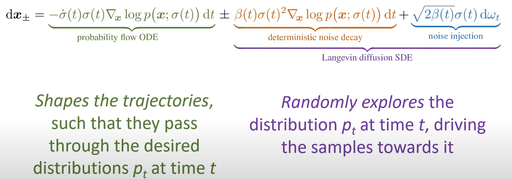
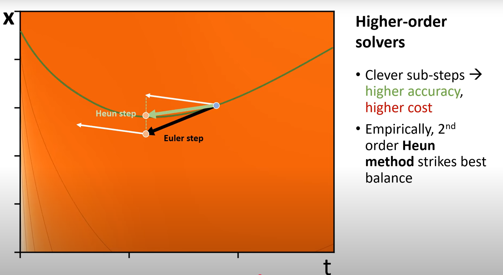
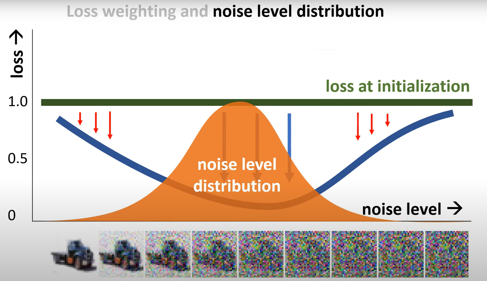
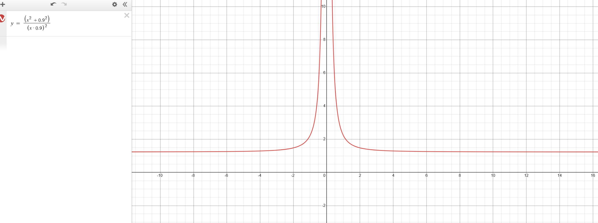
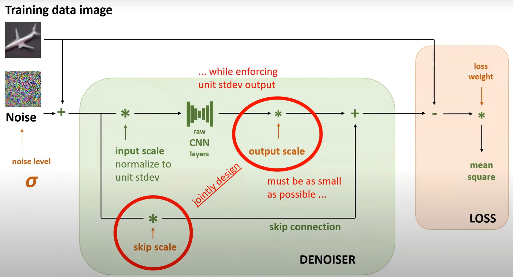

# Sparse Elucidated Latent Diffusion Transformer for text guided image synthesis
This repository contains the implementation resources for a **1.2B** parameters Sparse Ellucidated Latent Diffusion Transformer Model, achieving state-of-the-art image generation results, achieving an FID of 12.7 in zero-shot generation on the COCO dataset, at a significantly reduced computational cost of **$1314**. 

# Results:

Prompt: *"Owl with moon as backdrop in _____ style"*
Styles: *Pixel-art, cyberpunk, starry night*"
---

Prompt: *"Moonlit night over a pond of lotuses and floating candles in drawn in the style of Starry Night by Vincent Van Gogh"*
---

Prompt: *"concept art of a lady knight in ____ style"*
Styles: *Pixel-art, cyberpunk, starry night*"
---

Prompt: *"A celestial dragon soaring through nebula clouds, sparkling with stardust"*
---

Prompt: *"In the land of mordor, where shadows lie"*
---

Prompt: *"A cosmic mage conjuring constellations in a swirling vortex of stars"*
---

# Table of contents:
- [Methodology](#methodology)
- [Diffusion Transformer Architecture](#Diffusion-Transformer-Architecture)

# Methodology:

## Implementation Details: Elucidated Diffusion Models (EDM)

This implementation is based on the "Elucidating the Design Space of Diffusion-Based Generative Models" (EDM) paper by Miika Aittala et al., which extends the Score-Based Generative Models (or Denoising Score Matching) framework formulated as Stochastic Differential Equations (SDEs) by Yang Song et al.

**Formulation of Diffusion Process as SDE:**

EDM models the diffusion process using an SDE, employing Langevin diffusion to refine the initial sample $x_T \sim \mathcal{N}(0, I)$ at each noise level $\sigma(t)$. This corrects for errors introduced during the initial sampling stage.

*Figure: SDE Formulation (Source: [Miika Aittala: Elucidating the Design Space of Diffusion-Based Generative Models](https://www.youtube.com/watch?v=T0Qxzf0eaio&t=2599s&ab_channel=FinnishCenterforArtificialIntelligenceFCAI))*

**Sampling:**
EDM models utilize a second-order Heun's-Euler solver to solve the SDE backwards for efficient and accurate sampling. 
The SDE uses score-function (log-gradient of true distribution) which can be computed using a denoiser, as explained in the work done by *Vincent Pascal* on *Denoising Score Matching*, the denoiser is approximated by the *Backbone Neural Network* in EDM models.
This repository provides implementation of deterministic sampler with option to introduce langevin dynamics for stochastic sampling.

*Figure: Second order Heun's Solver for sampling (Source: [Miika Aittala: Elucidating the Design Space of Diffusion-Based Generative Models](https://www.youtube.com/watch?v=T0Qxzf0eaio&t=2599s&ab_channel=FinnishCenterforArtificialIntelligenceFCAI))*

EDM addresses the inefficiencies of uniform noise sampling in traditional diffusion models. Specifically:

* **Low Noise Levels:** At low noise levels, the transformation is approximately an identity transformation, leading to diminishing returns for the network predicting the negative score (noise). Uniform sampling of noise levels during training leads to redundant computation in this noise region.

* **High Noise Levels:** At high noise levels, the task devolves into approximating the original image from addition of two noisy signals, resulting in high variance and training instability.

To mitigate these issues, EDM employs a log-normal distribution for the noise schedule, $\sigma(t)$, centered around $\mu$ and $\sigma$. This focuses training on the intermediate noise levels where productive learning occurs, while still allowing the model to learn at extreme noise levels.

*Figure: Log-normal Noise level distribution during training (Source: [Miika Aittala: Elucidating the Design Space of Diffusion-Based Generative Models](https://www.youtube.com/watch?v=T0Qxzf0eaio&t=2599s&ab_channel=FinnishCenterforArtificialIntelligenceFCAI))*

Furthermore, EDM incorporates:

* **Loss Weighting:** Losses are weighted according to the noise schedule, optimizing training efficiency.

*Figure: Loss weigting at different noise levels during training*

* **Skip Connection Modulation:** The skip connection, used to predict the original image $x_0$ at low noise levels, is disabled at high noise levels. This reinforces the semantic distinction between noise prediction and direct image approximation while addressing the potential case of unstable training at high noise levels by proxy of high variance resulting from the model objective being formulated as MSE minimization between original $x_0$ and output of the model, which is simply addition of the appropriately scaled negative score predicted by the *Backbone Network* `c_out` * `negative_eps` and the input signal `x_t` to the backbone.
Thus the *Backbone Network* is encouraged to output straight approximation of $x_0$ by disabling the skip addition, to prevent the case of trying to predict $x_0$ as addition of two largely noisy signals (`c_out` * `negative_eps` + `x_t`).

* **Input Preconditioning:** Instead of scaling the ODE to preserve variance (which distorts probability flow), EDM normalizes the input signal via preconditioning, stabilizing deep network training.

*Figure: EDM Training Structure (Source: [Miika Aittala: Elucidating the Design Space of Diffusion-Based Generative Models](https://www.youtube.com/watch?v=T0Qxzf0eaio&t=2599s&ab_channel=FinnishCenterforArtificialIntelligenceFCAI))*
*Note that this repository implements a sparse diffusion transformer to parametrize the denoiser to approximate the score function of true distribution* 

# Diffusion Transformer Architecture

attained State of the art results at micro budget, primarily achieved by pretraining with patch masking ratio of 75% to reduce input seq length to diffusion transformer backbone and utilizing a lightweight patchmixer transformer to capture global context prior to applying masking to retain semantic information of entire image and increase the effectiveness of pretraining task to learn/distill representation for masked denoising process. The learned representation is further refined after pretraining stage by fine tuning with 0 masking ratio.

First we pretrain the model on 256x256 images then fine tune on the same resolution, and repeat the pretraining into fine tuning pipleline on 512x512 images by scaling the sinusoidal positional embeddings appropriately.

The model learns to basically generates images from text prompts using state of the art diffusion modeling has 1.2B parameters Expert Choice style Mixture of experts, diffusion transformer backbone, runs cross attention on text latent embeddings from Open clip model (openclip:hf-hub:apple/DFN5B-CLIP-ViT-H-14-378) and uses Variational autoencoder (model:stabilityai/stable-diffusion-xl-base-1.0) to translate images into latent space to make training computationally feasible and facilitate high resolution image synthesis exploiting latent diffusion.

it was trained on 25M image-text pairs from JourneyDB, diffusionDB, SegmentAnything1B (sa1b) datasets, using Fully Sharded Data Parallel and Hydracomposer framework
